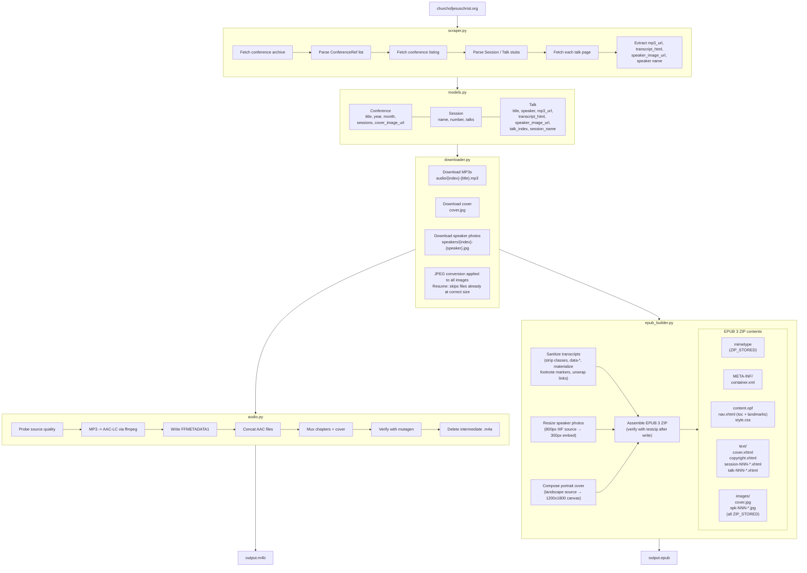

# Scraper Pipeline

```mermaid
flowchart TD
    SOURCE["churchofjesuschrist.org"]

    SOURCE --> SCRAPER

    subgraph SCRAPER["scraper.py"]
        S1["Fetch conference archive"]
        S2["Parse ConferenceRef list"]
        S3["Fetch conference listing"]
        S4["Parse Session / Talk stubs"]
        S5["Fetch each talk page"]
        S6["Extract mp3_url, transcript_html,\nspeaker_image_url, speaker name"]
        S1 --> S2 --> S3 --> S4 --> S5 --> S6
    end

    SCRAPER --> MODELS

    subgraph MODELS["models.py"]
        direction LR
        M1["Conference\ntitle, year, month,\nsessions, cover_image_url"]
        M2["Session\nname, number, talks"]
        M3["Talk\ntitle, speaker, mp3_url,\ntranscript_html, speaker_image_url,\ntalk_index, session_name"]
        M1 --- M2 --- M3
    end

    MODELS --> DOWNLOADER

    subgraph DOWNLOADER["downloader.py"]
        D1["Download MP3s\naudio/{index}-{title}.mp3"]
        D2["Download cover\ncover.jpg"]
        D3["Download speaker photos\nspeakers/{index}-{speaker}.jpg"]
        D4["JPEG conversion applied to all images\nResume: skips files already at correct size"]
    end

    DOWNLOADER --> AUDIO
    DOWNLOADER --> EPUB

    subgraph AUDIO["audio.py"]
        A1["Probe source quality"]
        A2["MP3 -> AAC-LC via ffmpeg"]
        A3["Write FFMETADATA1"]
        A4["Concat AAC files"]
        A5["Mux chapters + cover"]
        A6["Verify with mutagen"]
        A7["Delete intermediate .m4a"]
        A1 --> A2 --> A3 --> A4 --> A5 --> A6 --> A7
    end

    subgraph EPUB["epub_builder.py"]
        E1["Sanitize transcripts\n(strip classes, data-*, materialize\nfootnote markers, unwrap links)"]
        E2["Resize speaker photos\n(800px IIIF source → 300px embed)"]
        E3["Compose portrait cover\n(landscape source → 1200x1800 canvas)"]
        E4["Assemble EPUB 3 ZIP\n(verify with testzip after write)"]
        E1 --> E4
        E2 --> E4
        E3 --> E4
        subgraph ZIP["EPUB 3 ZIP contents"]
            direction LR
            Z1["mimetype\n(ZIP_STORED)"]
            Z2["META-INF/\ncontainer.xml"]
            Z3["content.opf\nnav.xhtml (toc + landmarks)\nstyle.css"]
            Z4["text/\ncover.xhtml\ncopyright.xhtml\nsession-NNN-*.xhtml\ntalk-NNN-*.xhtml"]
            Z5["images/\ncover.jpg\nspk-NNN-*.jpg\n(all ZIP_STORED)"]
        end
        E4 --> ZIP
    end

    AUDIO --> M4B["output.m4b"]
    EPUB --> EPUBOUT["output.epub"]
```
